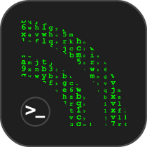

[](https://github.com/lapicidae/feed-actions)

Trigger action if Web-Feed (RSS or Atom) changes.


# [lapicidae/feed-actions](https://github.com/lapicidae/feed-actions)

[](https://github.com/lapicidae/feed-actions)
[](https://hub.docker.com/r/lapicidae/feed-actions)
[](https://hub.docker.com/r/lapicidae/feed-actions)
[](https://github.com/lapicidae/feed-actions/actions/workflows/docker.yml)


The Feed Actions Docker image is based on [Alpine Linux](https://alpinelinux.org/), [cron](https://en.wikipedia.org/wiki/Cron) and [rsstail](https://github.com/oldlaptop/rsstail).


## Features

* regular and timely application updates
* [BusyBox](https://www.busybox.net/) provides a subset of over two hundred utilities
* schedule via cronjob
* simple configuration

### *Note*
The image is automatically rebuilt when the [alpine (latest)](https://hub.docker.com/_/alpine) Official Docker Image receives an update.


## Getting Started

### Usage
Here are some example snippets to help you get started creating a container.

#### *docker-compose (recommended)*

Compatible with docker-compose v2 schemas.
```yaml
version: "2.1"
services:
  feed-actions:
    image: lapicidae/feed-actions
    container_name: feed-actions
    environment:
      - TZ=Europe/London
    volumes:
      - /path/to/config:/config
    restart: unless-stopped
```

#### *docker cli*

```bash
docker run -d \
  --name=feed-actions \
  -e TZ=Europe/London \
  -v /path/to/config:/config \
  --restart unless-stopped \
  lapicidae/feed-actions
```

### Parameters

Container images are configured using parameters passed at runtime.

| Parameter | Function |
|-----|-----|
| `-e TZ=Europe/London` | Specify a [timezone](https://en.wikipedia.org/wiki/List_of_tz_database_time_zones#List) to use (e.g. Europe/London) |


## Configuration
Simply edit the two files provided.

### fa-cron:
```bash
2 3 * * * /bin/bash /usr/bin/feed-actions
```
Change the time at which the magic happens.  
crontab exampels -> [crontab.guru](https://crontab.guru)  
Do not change the `/bin/bash /usr/bin/feed-actions` part!

### config.cfg:

```dosini
[test-project]
URL='http://www.test.org/feed.atom'
TRIGGER='curl -X POST https://hub.docker.com/api/build/v1/source/r2136542-9h8d-6rfd-5687-21fc6d2365tz/trigger/fe67d9a4-3d8b-5963-a5d8-25dc46cf5879/call/'
```
| Section | Function |
|-----|-----|
| `[name]` | Section name - **must be unique !!** |
| `URL` | RSS or Atom Feed URL |
| `TRIGGER` | Bash one-liner |


## Note
Take a look at [RSSHub](https://docs.rsshub.app/en/). 🍰 Everything is RSSible!

